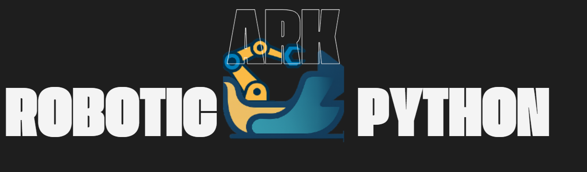

<p align="center">
  
</p>

<h1 align="center">A Python framework for robotics research and development.</h1>

<p align="center">
  <em>Lightweight, flexible, and designed for researchers and developers in robot learning.</em>
</p>

<p align="center">
  <a href="https://pepy.tech/project/ark-robotics">
    
  </a>
  <a href="https://opensource.org/licenses/MIT">
    
  </a>
  <a href="https://github.com/Robotics-Ark/ark_framework/commits/main">
    
  </a>
  <a href="https://github.com/Robotics-Ark/ark_framework/stargazers">
    
  </a>
</p>

<p align="center">
  ⭐ <b>Star us on GitHub — your support motivates us a lot!</b> 🙏😊
</p>

<p align="center">
  <a href="https://twitter.com/intent/tweet?text=Check+out+ark_framework:+https://github.com/Robotics-Ark/ark_framework">
    
  </a>
  <a href="https://www.facebook.com/sharer/sharer.php?u=https://github.com/Robotics-Ark/ark_framework">
    
  </a>
  <a href="https://t.me/share/url?url=https://github.com/Robotics-Ark/ark_framework&text=Check+out+ark_framework">
    
  </a>
  <a href="https://www.linkedin.com/sharing/share-offsite/?url=https://github.com/Robotics-Ark/ark_framework">
    
  </a>
</p>

<p align="center">
  Join us on Discord!
</p>
<p align="center">
 <a target="_blank" href="https://discord.gg/Mj9HPrUYcf"></a>
</p>

## What is this about? 

Ark is a Python-first playground for robot learning. 
Instead of wrestling with C++ and fragmented tools, you can collect data, train policies, and switch between simulation and real robots with just a few lines of code. 
Think of it as the PyTorch + Gym for robotics — simple, modular, and built for rapid prototyping of intelligent robots.

📚 **Learn more:**  
- [📖 Tutorials]()  
- [⚙️ Documentation]()  
- [📄 Research Paper]()

# Installation

1. Create and activate a conda environment.
  - Python 3.12 is recommended.
  - E.g, `conda create -n ark python=3.12`
2. Clone this repository and change directory `cd ark_framework`.
3. Install [zenoh-python](https://github.com/eclipse-zenoh/zenoh-python)
   - Installation instructions are found [here](https://github.com/eclipse-zenoh/zenoh-python#how-to-install-it).
   - It is recommended to [enable zenoh features](https://github.com/eclipse-zenoh/zenoh-python#enable-zenoh-features).
4. Install: `pip install -e .`

## Cite

```bibtex
@misc{robotark2025,
  title = {An Open-source Python-based Framework for Embodied AI},
  author = {Magnus Dierking, Christopher E. Mower, Refinath S N, Abhineet Kumar, Huang Helong, Jiacheng Qiu, Wei Chen, Huidong Liang, Huang Guowei, Jan Peters, Quan Xingyue, Jun Wang, Haitham Bou-Ammar},
  year = {2025},
  howpublished = {\url{https://robotics-ark.github.io/ark_robotics.github.io/}},
  note = {Technical report}
}
```
